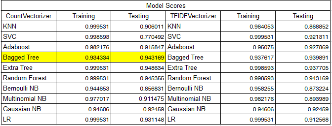

# NewLightTechnologies: Wildfire Prediction using Twitter Feed

## Problem Statement

In recent years, the world has seen many natural disasters which have caused tremendous damage to life and property. Some of the major disasters the world has seen this year are the Amazon fires, the Australian fires and the cyclone system in the Bay of Begal in South Asian. Social media, when used properly, can solve many problems during natural disasters. First responders can use social media to reach the most vulnerable in a prioritizing manner. Facebook, Instagram posts and Twitter tweets can be used in an efficient natural language processing model to guide revelant resouces to tend to the severely affected. The goal of the project is to predict wildfires in a given area and map the locations using Twitter posts.

## Executive Summary

A modeling data set was compiled using wildfire Tweets from CrisisLex.org (https://crisislex.org/) and non relevant tweets scraped from Twitter.The tweets in the data set were labeled as either 'witness' or 'don't know' and then encoded into 1 and 0 respectively. Multiple classication models are trained and the one with the best accuracy score was deployed as a web application using Heroku.

## Data Dictionary 

A data dictionary was compiled to explain the data set ([cleaned_train_data.csv](./data/cleaned_train_data.csv)).

|Feature|Type|Description|
|---|---|---|
|**category**|*string*| There are 2 categories, "witness" and "don't know". "witness" means that the tweet is from a person witnesses wildfires or a person's friends or family witness wildfire. "don't know" means that the tweet is not relevant to wildfires |
|**text**|*string*| Tweet text |
|**label**|*int*| If the category is "witness", the label is 1. If the category is "don't_know", the label is 0. |

## Data Collection

Tweet data for modeling was gathered from two sources: CrisisLex.org (https://crisislex.org/), a website housing natural disaster datasets and Twitter scraping. In order for the model to be trained properly to detect whether a tweet is about a wildfire or not, along with tweets related to wildfire disasters, tweets unrelated to wildfire disasters are needed as well. Since CrisisLex.org did not have enough non-wildfire disaster related tweets, the keywords 'habit', 'sweet', 'snow', 'music', 'sports', and 'movies', were used to scrape Twitter to gather the required amount of the non-wildfire disaster related tweets to properly train the data.

## EDA and Data Cleaning

Tweets were labeled 1 or 0 based on whether they belonged to either 'witness' or 'don't know' category. Tweet texts was then cleaned by removing urls, hyperlinks, punctionation,  locations and was then converted to lowercase.

## Preprocessing and Visualizations

Stopwords were removed from the cleaned data and it was then stemmed. A bar graph was then created to visualize which words occured more frequently within wildfire related tweets. The data was then exported as a .csv for modeling

## Modeling

Multiple models were developed as binary classifiers which labels tweets are 'witness' (1) or ' don't know' (0).Common pipeline parameters were kept constant through all models. A summary of accuracy scores from different models is shown in the image below:

## Web Application

Our goal is to predict wildfires and map the area where wildfires appear using tweets posted by Twitter users. A web application was created to map the probability of a wildfire occurance. The application shows the probability of an occurance indicated by red pins on a map using Google Maps. The data for demonstrating this app was collected using [twitterscraper](https://github.com/taspinar/twitterscraper). As of now (August 2020) in California, there are currently burning wildfires. Tweets related to the current wildfires were scraped from Twitter using keywords such as "#applefire", "#hogfire", "#goldfire", and "wildfire near:california". The geo-locational data for tweets were needed to pinpoint wildfires, but it was not able to be extracted by just using twitterscraper. In addition, most user don't share their exact geo-locational information on the tweet nor on their user profile page. Therefore, we decided to extract geo locatioanl data from their tweets manually. Since the amount of time spent scraping was not a lot, the mapping data was relatively small. Therefore, in order to show the app's functionality, locations with a very small probability of a wildfire occuring are still included.

Main Architectual Parts
- The application framework is Flask.
- The WGSI (Web Server Gateway Interface) is gunicorn.
- The platform for deploying our app is [Heroku](https://www.heroku.com/).
- The API for mapping is Maps Javascript API from [Google Developer](https://developers.google.com/).
- The library to use Google Maps is [googlemaps](https://github.com/googlemaps/google-maps-services-python).
- [App URL](https://demo-meat-213.herokuapp.com/) (This app instance will be discarded after finishing the presentation on 2020-08-17).

- A data dictionary for mapping is below ([mapping_for_app.csv](./data/mapping_for_app.csv)).

|Feature|Type|Description|
|---|---|---|
|**text**|*string*| Tweet text |
|**time**|*string*| Tweeted time |
|**latitude**|*float*| Location coordinate latitude gathered from tweet |
|**longitude**|*float*| Location coordinate longitude gathered from tweet |

## Conclusions and Recommendations

Although this app is able to calculate the possibility of a wildfire occuring in a certain California area, this app still has some limitations. Firstly, the geo-locational information is currently being extracted manually and therefore is not very scalable at the moment. Automation will be needed in order to extract geo-locational information more effectively in terms of speed and quantity. Secondly, the data is currently stored as a static csv file. In the future, with automation, adding a database integration for dynamic updates will make this app more responsive to real-time changes. For example, the app could scrape tweets at a certain time interval (e.g. every hour) and store the relevant data from the tweet in a databese, the model would pull in the new information from the database and update the wildfire map with updated probabilities.

## Sources

- The dataset which from [CrisisLex.org](https://crisislex.org/) is the same dataset used by [Kiran et al. (2020)](https://www.sciencedirect.com/science/article/pii/S0306457319303590).
- [twitterscraper](https://github.com/taspinar/twitterscraper)
- [Maps Javascript API](https://developers.google.com/)
- [Heroku](https://www.heroku.com/)

Kiran, Z., Muhammad, I., & Frank, O. O. (2020). Automatic identification of eyewitness messages on twitter during disasters. Information Procession & Management.
